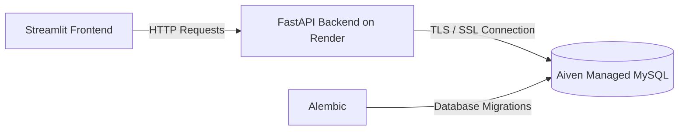
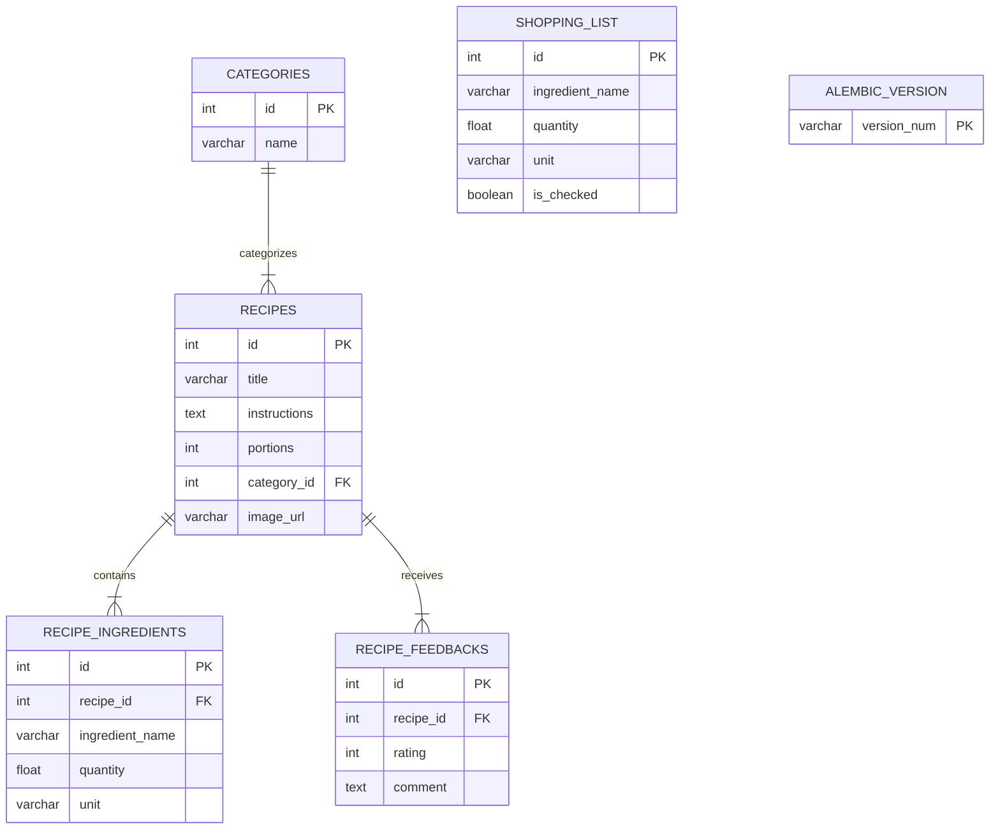

# 🍳 Anna's Køkken

**Anna's Køkken** is a full-stack web application for managing and organizing a personal digital cookbook. The project follows a clean architecture with a clear separation of responsibilities between the frontend, backend, and database layers. It also emphasizes relational database design, database version control, and cloud deployment using modern data engineering practices.

---

# 🚀 Features

### 📖 Digital Cookbook
- Create, edit, delete, and browse recipes.
- Organize recipes into categories.
- Store cooking instructions, portions, ingredients, and images.

### ⚖️ The Scale Master
A built-in ingredient calculator that dynamically rescales ingredient quantities according to the desired number of servings.

### 🛒 Mad & Market
A smart shopping list that:
- Aggregates ingredients from multiple selected recipes.
- Consolidates duplicate ingredients.
- Allows manual ingredient additions.
- Tracks purchased items using checkboxes.

---

# 🏗️ Architecture

The application is deployed across multiple cloud providers to keep each component independent.



### Frontend
- **Framework:** Streamlit
- Interactive user interface
- Communicates with the REST API

### Backend
- **Framework:** FastAPI
- RESTful API
- Business logic
- Request validation using Pydantic
- SQLAlchemy ORM

### Database
- **MySQL**
- Hosted on **Aiven Cloud**
- Secure SSL/TLS connection
- Fully relational database

### Database Version Control
- Alembic migrations
- Schema evolution managed as code

---

# 📊 Database Schema

The database is normalized (3NF) to preserve referential integrity and reduce redundancy.



---

# 🧠 Data Engineering Highlights

## Decoupled Shopping List

The `shopping_list` table intentionally has **no foreign key constraints**.

This design allows:

- Aggregating ingredients from multiple recipes.
- Adding standalone shopping items.
- Simplifying ingredient consolidation.
- Greater flexibility for future extensions.

---

## Schema Evolution

Database changes are managed using **Alembic**.

- No manual schema modifications.
- Version-controlled migrations.
- Reproducible database deployments.
- Infrastructure as Code approach.

---

## Secure Database Communication

All connections to the remote MySQL database require TLS encryption.

```text
ssl_mode=REQUIRED
```

---

## Data Sanitization

When deploying from local development to production, stored image URLs were updated using SQL:

```sql
UPDATE recipes
SET image_url = REPLACE(
    image_url,
    'http://localhost:8000',
    'https://your-render-domain.onrender.com'
)
WHERE image_url LIKE 'http://localhost:8000%';
```

---

# 📁 Project Structure

```text
annas-kokken/
│
├── alembic/
│   ├── versions/
│   └── env.py
│
├── backend/
│   ├── database.py
│   ├── main.py
│   ├── models.py
│   └── schemas.py
│
├── frontend/
│   └── app.py
│
├── alembic.ini
├── requirements.txt
├── .env.example
└── README.md
```

---

# 🛠️ Technology Stack

| Layer | Technologies |
|--------|--------------|
| Frontend | Streamlit |
| Backend | FastAPI |
| ORM | SQLAlchemy |
| Validation | Pydantic |
| Database | MySQL |
| Cloud Database | Aiven |
| Backend Hosting | Render |
| Database Migration | Alembic |
| Language | Python 3 |
| API Documentation | Swagger / OpenAPI |

---

# ⚙️ Installation

## 1. Clone the repository

```bash
git clone <repository-url>
cd annas-kokken
```

---

## 2. Create a virtual environment

### Windows

```bash
python -m venv .venv
.venv\Scripts\activate
```

### Linux / macOS

```bash
python -m venv .venv
source .venv/bin/activate
```

---

## 3. Install dependencies

```bash
pip install -r requirements.txt
```

---

## 4. Configure environment variables

Create a `.env` file in the project root.

```env
DATABASE_URL="mysql+pymysql://<USER>:<PASSWORD>@<HOST>:<PORT>/<DATABASE>?ssl_mode=REQUIRED"
```

---

## 5. Apply database migrations

```bash
alembic upgrade head
```

---
## 6. Run the backend

```bash
uvicorn backend.main:app --reload
```

Swagger documentation will be available at:

```
http://127.0.0.1:8000/docs
```

---

## 7. Run the frontend

```bash
streamlit run frontend/app.py
```

---

# 🌐 Deployment

| Component | Platform |
|-----------|----------|
| Frontend | Streamlit Cloud |
| Backend | Render |
| Database | Aiven Managed MySQL |

---

# 📚 API Documentation

FastAPI automatically generates interactive API documentation.

- Swagger UI: `http://127.0.0.1:8000/docs`
- ReDoc: `http://127.0.0.1:8000/redoc`

---

# 🔒 Security

- TLS-encrypted database connections.
- Environment variables for sensitive credentials.
- Pydantic request validation.
- SQLAlchemy ORM to prevent SQL injection.
- Database migrations tracked through Alembic.

---

# 👩‍💻 Author

**Madalena Bernardo**

Bachelor's Degree in Informatics and Communications Student  
Polytechnic University of Bragança (UPB)

---

# 📄 License

This project is licensed under the [MIT License](LICENSE)
